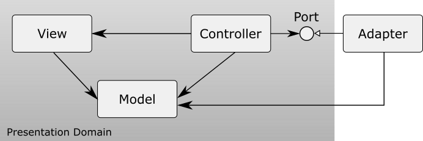

## Overview

Windows Forms MVC is a class library for Windows Forms with Model View Controller architecture.



In Windows Forms MVC, the roles of a model, view, and controller are redefined as follows.

### Model

The model represents an object model in the presentation domain.
It has its properties, its internal states, events that occur when its internal states are changed, that are usually normal .NET events, and so on,
but does not have any business logic.
It is similar to Presentation Model, but unlike to Presentation Model, it does not have main presentaion logic.
It has only behaviors for internal states that is encapsulated.
It has also references to other models and sends messages to each other.

### View

The view represents an appearance of the model.
As it knows a model associated with it, values of its properties are set by binding values of the model.

### Controller

The controller handles events that occur on the view by using the model associated with the view.
It has a reference to the business domain and sends a message to it to execute business logic.
Its reference to the business domain is usually injected by DI container.

The basic flow is as follows;

1. An event occurs on the view or on other domain.
1. The controller receives it and sends an appropriate message to the model.
1. The model updates its internal states.
1. The view receives the change of the model and updates its appearance.

## Features

### View

The ContentViewAttribute is provided to specify the model associated with the view to the view.

The DataContextSource is provided to set the instance of the model associated with the view.
When the DataContextChanged event of the DataContextSource occurs, the value of the model should be bound to the property of the view.

The WindowsFormsController is provided to associate controllers that handle events on the view with the view.
The view should be set to the View property of the WindowsFormsController.

The typical implementation of the view is as follows;

``` csharp
[ContentView(typeof(LoginContent))]
public class LoginView : UserControl
{
    private IContainer components;
    private DataContextSource dataContextSource;
    private WindowsFormsController windowsFormsController;

    private TextBox userIdTextBox;
    ...

    protected override void Dispose(bool disposing)
    {
        if (disposing && (components != null))
        {
            components.Dispose();
        }
        base.Dispose(disposing);
    }

    private void InitializeComponent()
    {
        components = new Container();

        dataContextSource = new DataContextSource(components);
        dataContextSource.DataContextChanged += dataContextSource_DataContextChanged;

        windowsFormsController = new WindowsFormsController();
        windowsFormsController.View = this;

        userIdTextBox = new TextBox();
        ...

        SuspendLayout();
        Controls.Add(userIdTextBox);
        ...
        ResumeLayout(false);
    }

    private readonly ObservablePropertyBindings observablePropertyBindings = new ObservablePropertyBindings();

    public LoginView()
    {
        InitializeComponent();
    }

    private void BindContent(LoginContent loginContent)
    {
        // The value of the model is bound to the property of the Control.
        observablePropertyBindings.BindTwoWay(loginContent.UserId.Value, userIdTextBox, nameof(userIdTextBox.Text));
        ...
    }

    private void UnbindContent(LoginContent loginContent)
    {
        // The value of the model is unbound from the property of the Control.
        observablePropertyBindings.Unbind();
    }

    private void dataContextSource_DataContextChanged(object? sender, DataContextChangedEventArgs e)
    {
        if (e.OldValue is LoginContent oldContent) UnbindContent(oldContent);
        if (e.NewValue is LoginContent newContent) BindContent(newContent);
    }
}
```

The ContentControl is provided to show the view with which the model is associated.
The ContentControl searches the view attributed by the ContetViewAttribute by the model that is set to the Content property and the instance of the model is set to the DataContextSource of the view.

### Controller

The ViewAttribute is provided to specify a controller to handle events that occur on the view.

``` csharp
[View]
class Controller {...}
```

The view to which the controller is attached is specified using the following properties.

- ViewType

  The type of the view to which the controller is attached is specified.

- Key

  The key of the view to which the controller is attached is specified. The name of the data context type can also be specified as the key.

The condition to search the controller is as follows;

1. whether the value of the ViewType is equal to the type of the view if the ViewType is specified. If the ViewType is not specified, the controller is the target.
1. whether the value of the Key is equal to the key of the view if the Key is specified. If the Key is not specified, the controller is the target. If the key of the view is not specified, search whether the Key is equal to:

   1. the name of the data context type.
   1. the full name of the data context type.
   1. the full name of the data context type without parameters if its type is generics.
   1. the name of the base type of the data context.
   1. the name of the interface that is implemented by the data context.

Note: This library does not provide a feature to specify the Key to the view. If the Key should be specified, add an implementation to find a key from the view by implementing the IElementKeyFinder interface.

A controller can be created with a factory that implements IWindowsFormsControllerFactory. If a factory is not specified, a default factory that creates a controller with Activator.CreateInstance method is used.

``` csharp
class ControllerFactory : IWindowsFormsControllerFactory {...}
```

``` csharp
WindowsFormsController.DefaultControllerFactory = new ControllerFactory();
```

The attributes are provided to inject event handlers, a data context, and controls to the controller.
The available attributes are as follows.

#### EventHandlerAttribute

This attribute is specified to the method to handle an event.
It is also specified to the property or the field that is defined with a delegate.
The method is declared as follows;

- No argument.

``` csharp
[EventHandler(ElementName = "ActionButton", Event = "Click")]
private void OnActionButtonClick()
{
    // implements the action.
}
```

- One argument that is a second argument of EventHandler.

``` csharp
[EventHandler(ElementName = "ActionButton", Event = "Click")]
private void OnActionButtonClick(EventArgs e)
{
    // implements the action.
}
```

- Two arguments that are a first argument and a second argument of EventHandler.

``` csharp
[EventHandler(ElementName = "ActionButton", Event = "Click")]
private void OnActionButtonClick(object? sender, EventArgs e)
{
    // implements the action.
}
```

If the method name is "[ElementName]_[EventName]", this attribute does not have to be specified.
``` csharp
private void ActionButton_Click()
{
    // implements the action.
}

private void ActionButton_Click(EventArgs e)
{
    // implements the action.
}

private void ActionButton_Click(object? sender, EventArgs e)
{
    // implements the action.
}
```

If the method is an async method, its suffix can be "Async".

``` csharp
private async Task ActionButton_ClickAsync()
{
    // implements the action.
}

private async Task ActionButton_ClickAsync(EventArgs e)
{
    // implements the action.
}

private async Task ActionButton_ClickAsync(object? sender, EventArgs e)
{
    // implements the action.
}
```

### FromDIAttribute

This attribute is specified to the parameter. Its parameter value is injected using the dependency injection.

``` csharp
private void ActionButton_Click([FromDI] IDataLoader dataLoader)
{
    // implements the action.
}

private void ActionButton_Click(EventArgs e, [FromDI] IDataLoader dataLoader)
{
    // implements the action.
}

private void ActionButton_Click(object? sender, EventArgs e, [FromDI] IDataLoader dataLoader)
{
    // implements the action.
}
```

### FromElementAttribute

This attribute is specified to the parameter.
Its parameter value is injected from the element of the specified parameter name in the view to which the controller is attached.
If the name of the element is different from the parameter name,
the name of the element is specified to the Name property of the FromElementAttribute.

``` csharp
private void ActionButton_Click([FromElement] Control control)
{
    // implements the action.
}

private void ActionButton_Click(EventArgs e, [FromElement(Name = "Control")] Control control)
{
    // implements the action.
}

private void ActionButton_Click(object? sender, EventArgs e, [FromElement] Control control)
{
    // implements the action.
}
```

### FromDataContextAttribute

This attribute is specified to the parameter. Its parameter value is injected from the data context of the view
to which the controller is attached.

``` csharp
private void ActionButton_Click([FromDataContext] DataContextType dataContext)
{
    // implements the action.
}

private void ActionButton_Click(EventArgs e, [FromDataContext] DataContextType dataContext)
{
    // implements the action.
}

private void ActionButton_Click(object? sender, EventArgs e, [FromDataContext] DataContextType dataContext)
{
    // implements the action.
}
```

#### DataContextAttribute

This attribute is specified to the field, property, or method to which a DataContext is injected.
The method has an argument the type of which is the one of a DataContext.
The implementation is as follows;

- Field

``` csharp
[DataContext]
private DataContexType? dataContext;
```

- Property

``` csharp
[DataContext]
public DataContexType? DataContext { get; set; }
```

- Method

``` csharp
[DataContext]
public void SetDataContext(DataContexType? dataContext)
{
    this.dataContext = dataContext;
}
private DataContexType? dataContext;
```

If the method name is "SetDataContext", this attribute does not have to be specified.
``` csharp
private void SetDataContext(DataContextType? dataContext)
{
    this.dataContext = dataContext;
}
private DataContextType? dataContext;
```

#### ElementAttribute

This attribute is specified to the field, property, or method to which a control is injected.
The method has an argument whose type is the one of a control.
The control whose name is equal to the one of field, property, or method is injected.
When the name of the method starts with "Set", the target name of the method is the value removed "Set" from the method name.
If the name of the control is different from the one of the field, property, or method,
the name of the control is specified to the Name property of the ElementAttribute.
The implementation to inject a control whose name is "Element" is as follows;

- Field

``` csharp
[Element(Name = "Control")]
private Control? control;
```

- Property

``` csharp
[Element]
public Control? Control { get; set; }
```

- Method

``` csharp
[Element]
public void SetControl(Control? control)
{
    this.control = control;
}
private Control? control;
```

## NuGet

[WindowsFormsMvc](https://www.nuget.org/packages/WindowsFormsMvc/)

## LICENSE

This software is released under the MIT License, see LICENSE.